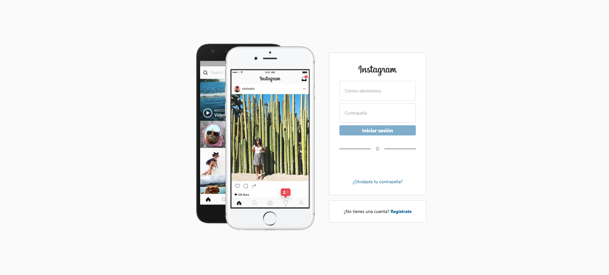
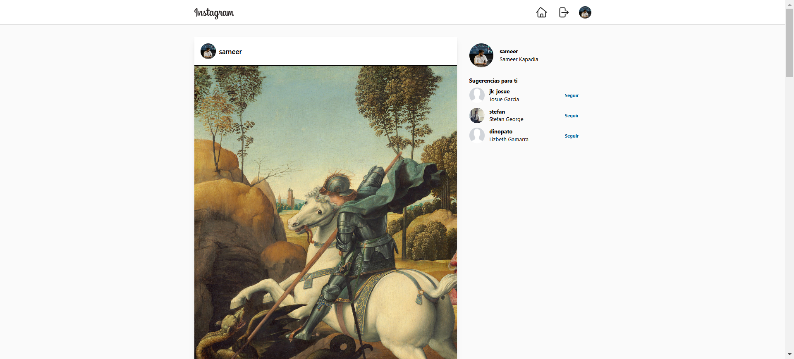
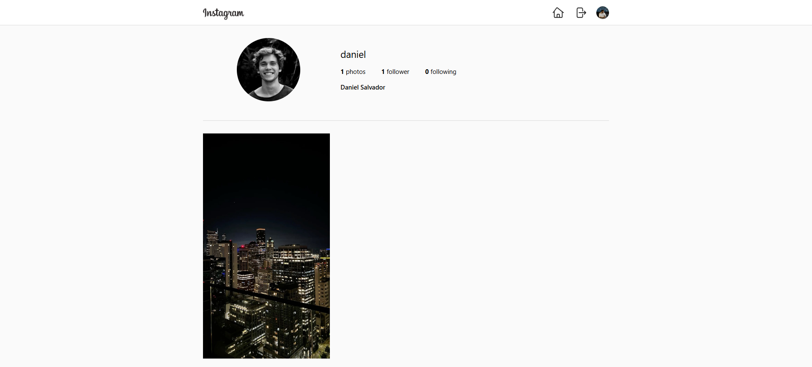

# 🌟 Clon de Instagram

Este proyecto es un **clon funcional de Instagram**, desarrollado para replicar las principales características de la famosa red social. Fue creado utilizando **React** para el frontend y **Firebase** para la gestión del backend, incluyendo autenticación de usuarios, almacenamiento de datos y manejo de perfiles. La interfaz está inspirada en el diseño original de Instagram, ofreciendo una experiencia fluida para compartir imágenes y realizar interacciones sociales.

---

## 🚀 Tecnologías Utilizadas

### 💻 Frontend
- **React**: Framework para construir interfaces de usuario modernas y dinámicas.
- **React Router**: Navegación entre páginas de forma rápida y eficiente.
- **Tailwind CSS**: Librería de estilos para un diseño responsivo y atractivo.

### 🛠 Backend
- **Firebase Authentication**: Sistema seguro para el registro e inicio de sesión de usuarios.
- **Firebase Firestore**: Base de datos en tiempo real para almacenar datos de usuarios y publicaciones.
- **Firebase Storage**: Almacenamiento de imágenes subidas por los usuarios.

---

## ✨ Características Destacadas

✔ **Autenticación de Usuarios**  
Los usuarios pueden registrarse e iniciar sesión utilizando su correo electrónico y contraseña.

✔ **Gestión de Perfiles**  
Cada usuario puede personalizar su perfil, incluyendo nombre de usuario, foto de perfil y configuraciones adicionales.

✔ **Publicación de Imágenes**  
Permite a los usuarios subir imágenes desde su dispositivo y compartirlas con otros.

✔ **Feed Personalizado**  
Un panel principal donde los usuarios pueden ver las publicaciones de las personas que siguen.

✔ **Manejo de Errores**  
Incluye una página personalizada para errores 404, mejorando la experiencia del usuario.

---

## 📸 Capturas de Pantalla

### 🔐 Inicio de Sesión / Registro


### 🖼 Parte De Publicaciones


### 🗂 Perfiles de usuarios


---

## 🛠 Instalación y Configuración

Sigue estos pasos para clonar e iniciar el proyecto en tu máquina local:

1. **Clona este repositorio:**
   ```bash
   git clone https://github.com/zinderellasnuff/web_project_clone_instagram.git
Accede a la carpeta del proyecto:
bash

Copiar
cd web_project_clone_instagram
Instala las dependencias:
bash

Copiar
npm install
Configura Firebase:
Crea un proyecto en Firebase desde su consola oficial.
Configura los servicios de autenticación y Firestore.
Crea un archivo .env en la raíz del proyecto con las credenciales de Firebase:
env

Copiar
REACT_APP_API_KEY=your-api-key
REACT_APP_AUTH_DOMAIN=your-auth-domain
REACT_APP_PROJECT_ID=your-project-id
REACT_APP_STORAGE_BUCKET=your-storage-bucket
REACT_APP_MESSAGING_SENDER_ID=your-messaging-sender-id
REACT_APP_APP_ID=your-app-id
Inicia el servidor de desarrollo:
bash

Copiar
npm start
Abre el proyecto en tu navegador:
Visita http://localhost:3000.
📂 Estructura del Proyecto
plaintext

Copiar
📦 web_project_clone_instagram
├── 📁 public          # Archivos públicos
├── 📁 src             # Código fuente principal
│   ├── 📁 components  # Componentes de React
│   ├── 📁 pages       # Páginas principales
│   ├── 📁 styles      # Archivos de estilo
│   └── 📁 utils       # Utilidades y helpers
├── .gitignore         # Archivos ignorados por Git
├── package.json       # Dependencias y configuraciones del proyecto
├── tailwind.config.js # Configuración de Tailwind CSS
└── vite.config.js     # Configuración del entorno de desarrollo
🤝 Contribución
¡Las contribuciones son bienvenidas! Si deseas mejorar este proyecto:

Haz un fork de este repositorio.
Crea una rama con tu nueva funcionalidad: git checkout -b feature/nueva-funcionalidad.
Realiza tus cambios y haz commit: git commit -m 'Agrega nueva funcionalidad'.
Envía un pull request.
📧 Contacto
Si tienes preguntas o sugerencias sobre este proyecto, no dudes en contactarme:

Autor: zinderellasnuff
Correo: tuemail@ejemplo.com